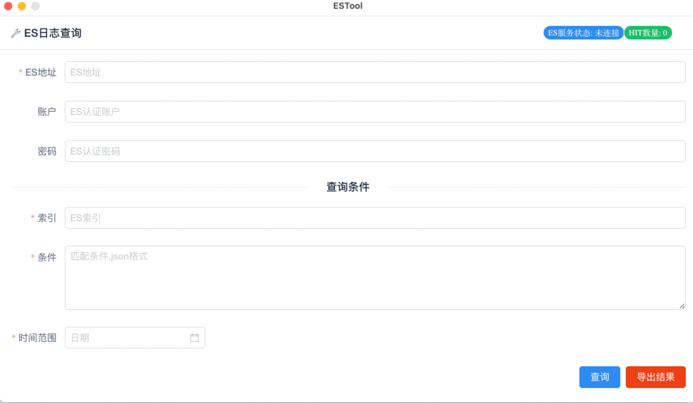

# estool
elasticsearch工具，查询导出数据

## Feature
* simple query
* log export to file

## Requirement
* golang v1.15+
* yarn v1.22.4+
* wails v1.11.0+

## Install
1. build ui
```$xslt
cd ui && yarn install && yarn build
```

2. build app
```$xslt
wails build
```

3. run app
```$xslt
chmod +x build/estool && build/estool
```

If you need more feature, just fork it :)

## Screenshot


## Links
* [wails](https://wails.app/gettingstarted/)
* [iView](https://iviewui.com/docs/introduce)
